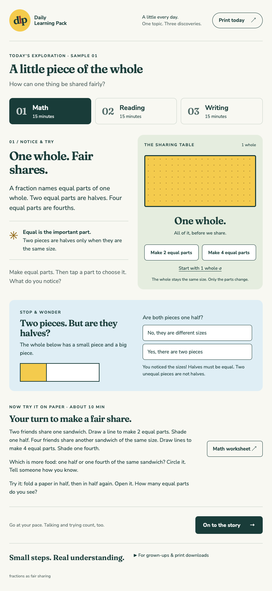

# Daily Learning Pack

**One topic. Three small discoveries.** A calm daily pack for **2nd grade (roughly ages 7–8)**: about **15 minutes math + 15 reading + 15 writing**. Use the iPad to notice and try; use paper to draw, think, and explain. A grown-up can read instructions aloud and take dictation.

The default complete sample day is **“engines.”** Leo and Jo explore how a push becomes a turn, add and subtract model engine turns, read _The push inside_, and explain how fuel, a piston, a rod, and a crankshaft work together. The curated **“inch worms”** day follows a looping caterpillar across a leaf. The original **“fractions as fair sharing”** day remains available as another curated sample. No accounts, backend, tracking, external font requests, or AI calls. The kid experience is static HTML, CSS, and a small JavaScript file.



## Generate a day

Requires **Node.js 22+**, npm, and a one-time Chromium download for PDF generation. The browser is a build tool; children do not download it.

```sh
npm ci
npx playwright install chromium
npm run build
```

`npm run build` produces the Grade 2 engines day. To supply the **only required input**, pass one quoted topic string:

```sh
npm run generate -- "engines"
npm run generate -- "inch worms"
npm run generate -- "fractions as fair sharing"
npm run generate -- "weather"
```

Every successful generation replaces the current `dist/` day and the five `output/pdf/` files. The default engines sample is restored with `npm run build`. Generation needs no API keys or network access after dependencies and the browser are installed.

| Output                                            | Purpose                                       |
| ------------------------------------------------- | --------------------------------------------- |
| `dist/index.html`                                 | Complete static learning experience           |
| `dist/pdf/kid-worksheets.pdf`                     | Three US Letter pages: math, reading, writing |
| `dist/pdf/math.pdf`, `reading.pdf`, `writing.pdf` | Individual one-page worksheets                |
| `dist/pdf/parent-answer-key.pdf`                  | Separate one-page parent key                  |
| `dist/print/*.html`                               | Inspectable print sources                     |
| `dist/pack.json`                                  | Fully expanded day data                       |
| `output/pdf/`                                     | The same five PDFs, convenient for printing   |

Print the kid PDF at **100% / actual size**, one-sided, on US Letter. Everything is legible in black and white; no answer depends on color. The parent key is deliberately absent from the kid PDF. Each 15-minute session includes discussion or drawing, not 15 minutes of worksheet filling. Use a pencil and scrap paper; crayons are optional.

### What “topic in → day out” means in this scaffold

- `engines`, `inch worms`, and `fractions as fair sharing` (ignoring case and extra spaces) select their carefully authored packs. No topic argument selects engines.
- Any other topic produces a **topic inquiry pack**: count the words and letters in that topic, explore grouping, read an original question-led story about it, and write an on-topic question. All three subjects use the same input string. No second input or reference book is required.
- Inquiry packs do **not** claim to teach factual concepts about arbitrary topics. They are usable language-and-counting activities, and a starting point for authoring a topic-specific lesson. The site and parent note label this mode. This repository contains three curated days, not a curriculum or an automatic factual lesson writer.
- Topics must contain letters and be 1–80 characters after whitespace normalization. The content is English; the shipped font subsets target Latin-script topics. HTML metacharacters are escaped. Generation rejects print overflow instead of delivering clipped worksheets.

## Grade 2 authoring default

Future days target **2nd grade**, not just an age label: use short sentences and concrete vocabulary; explain necessary topic words in context; practice addition and subtraction within 100, tens and ones, and simple skip counting. Offer drawing, oral rehearsal, sentence frames, a word bank, and wide writing lines with dashed midlines. Read-aloud help and dictation are welcome. Each subject has a 15-minute parent plan; the times include talk and drawing.

For engines, math uses **24 + 18**, **60 − 42**, and **counting by 2 to 20**. Tap through fuel → gases → motion, then count pairs of full turns and solve Jo's two connected problems. Optional hints bridge through a ten. Reading follows the parts and invites children to help Leo correct an idea. Writing offers three separate sentence frames, a labeled drawing, and a word bank. Each subject still takes about 15 minutes.

**Preview this refined day:** run `npm run build`, then `npm run preview` and open **http://127.0.0.1:4173/daily-learning-pack/**. In Math, tap “Fuel burns,” “Gases push,” and “A shaft turns”; only the last tap plays a short, non-looping stroke (instant with reduced motion). The print pages have generous calculation areas, a count-by-two strip, and a separate ruled line for each writing frame. All five PDFs are rebuilt in `output/pdf/`; the three digital subjects are in `dist/index.html`. Fair sharing and inchworms remain available through their topic commands.

The engine lesson describes a **gasoline piston engine**. Fuel burns with air; expanding hot gases push a piston linked by a rod to a turning crankshaft. It does not imply that every engine works this way or that all fuel energy becomes motion. The parts diagram shows only the outward stroke and omits timing, valves, and drivetrain details; one push turns the shaft partway, not a full turn; the turn counter is a number model, not a speed or fuel simulation. Factual reference for authors: [U.S. Department of Energy, Internal Combustion Engine Basics](https://www.energy.gov/cmei/vehicles/articles/internal-combustion-engine-basics). No factual source is fetched at build time or runtime.

## Inchworms · A loop becomes a step

```sh
npm run generate -- "inch worms"
npm test
npm run test:browser
npm run preview
```

Open **http://127.0.0.1:4173/daily-learning-pack/**. `inchworm`, `inchworms`, `inch worm`, `inch-worm`, and `inch-worms` also select this curated Grade 2 day, ignoring case and extra spaces. **`npm run build` still builds/restores engines.** Generated outputs replace the current day; no new route or public Wonder Together navigation is added. Wonder Daily remains an internal, parent-led dogfood experience.

- **Math, about 15 min:** tap **Grip → Loop → Stretch**, then use pretend inches for **24 + 18**, **60 − 42**, and counting by 2 to 20. Optional hints bridge through a ten. The two print workspaces accept jumps, tens and ones, or a spoken explanation.
- **Reading, about 15 min:** Leo and Jo watch the front grip, rear pull up, and front stretch. The original story introduces _loop_, _grip_, and _stretch_, explains the measuring-like name, and corrects the idea that inchworms have no legs and merely slide.
- **Writing, about 15 min:** label **front / rear / loop** in a drawing, add a direction arrow, and explain the sequence with **First / Next / Then** frames and a word bank. A grown-up can take dictation.

**Model honesty:** “about one inch per loop” is a kid-friendly model, not a lab claim. In the math game, each pretend loop stands for exactly 1 inch so children can practice addition and subtraction. Real steps vary. Neither the diagram nor the number strip is a life-size ruler, a simulation, or recorded worm movement. An inchworm is a moth caterpillar with true legs at the front and gripping prolegs near the rear. Author references: [Virginia Museum of Natural History, Inchworms](https://www.vmnh.net/article/inchworms) and [Amateur Entomologists’ Society, Geometer](https://www.amentsoc.org/insects/glossary/terms/geometer/). No source is fetched during build or use.

**Craft choices locked for this edition:** locally bundled **Newsreader + Inter** carry the house editorial voice with a calm serif for digital reading and a clear sans serif for task instructions. Warm stock, deep ink, restrained rules, and 8px-based spacing repeat across subjects; gold is limited to fine rules and sky to informational hints. The signature is a segmented, leaf-side line drawing, shared by screen and print through `wormPose` in `src/inchworm.js`; `src/inchworms.css` owns this edition’s type and color roles. In Math, one tap plays one purposeful, one-second movement; reduced motion settles immediately, and rapid taps or leaving Math cancel the prior movement. This focused edition uses the existing subject navigation, motion-step controls, math missions, and writing frames. Engines and fair sharing retain their earlier typography and palettes.

**Family reading (dogfood):** On the inchworms day, Reading opens with a cover invite, then one teaching beat per screen. Grown-up reads; child taps **Open the story** / **Next**. Teaching motion is the letterbox worm morph; page enter is opacity-only. Print story stays the separate B&W-safe Letter PDF (not a browser Print of the digital reader).

## View locally

```sh
npm run preview
```

Open **http://127.0.0.1:4173/daily-learning-pack/**. The project prefix intentionally matches GitHub Pages. All asset and download paths are relative.

For an actual iPad on the same Wi-Fi, run `HOST=0.0.0.0 npm run preview`, then open `http://YOUR-MAC-LAN-IP:4173/daily-learning-pack/` in Safari. The preview is temporary; stop it with Ctrl-C. Digital writing stays in memory while switching subjects and disappears on reload. There is no storage or submission.

## Public archive (Leo’s morning door)

Approved days are listed on a quiet parent-led landing (Newsreader + Inter, paper and ink). The list is generated at build time from [`archive/approved.json`](archive/approved.json). The first live row is the curiosity-bean dogfood morning.

| Path                                                        | Purpose                                    |
| ----------------------------------------------------------- | ------------------------------------------ |
| `/` after `npm run site`, or `/archive/` after any generate | Archive index: date, title, teaser, link   |
| `/today/`                                                   | Latest approved pack · Leo’s one-tap entry |
| `/days/<slug>/`                                             | That day’s pack experience                 |

```sh
npm run generate -- "curiosity bean"
npm run preview
```

Open [http://127.0.0.1:4173/daily-learning-pack/archive/](http://127.0.0.1:4173/daily-learning-pack/archive/). `npm run site` puts the same landing at the site root for Vercel / Pages. Operational notes, overnight fire, and production promote: [`docs/overnight.md`](docs/overnight.md).

**Preferred public host:** Vercel project `wonder-daily` (`vercel.json` → `npm run site`). This repository does not force a production deploy. After a human merges, promote `main` in the Vercel dashboard if production does not auto-update. Fallback: GitHub Pages as below. Wonder Daily is not added to public Wonder Together marketing navigation.

## GitHub Pages

This PR does **not** merge, publish, enable Pages, or push to main. PR checks upload a downloadable `daily-learning-pack-preview` artifact containing the built site, PDFs, and screenshots.

When you choose to publish after review:

1. Merge the reviewed PR yourself.
2. In **Settings → Pages → Build and deployment**, choose **GitHub Actions**.
3. In **Actions → Publish learning pack to Pages → Run workflow**, select `main`.
4. The workflow runs `npm run site`. The expected project URL is **https://kbo4sho.github.io/daily-learning-pack/** (archive at `/`, latest pack at `/today/`). It is not live merely because the build exists.

The deployment workflow is manual and restricted to `main`; PR checks have no deployment permissions. A private repository needs a plan that supports private-repo Pages (for a personal account, GitHub Pro). A public Pages site can be viewed without a login even when its source repository is private. See [GitHub’s custom Pages workflow guide](https://docs.github.com/en/pages/getting-started-with-github-pages/using-custom-workflows-with-github-pages) and [Pages visibility](https://docs.github.com/en/pages/getting-started-with-github-pages/about-github-pages#limits-on-use-of-github-pages). No repository settings are changed by this scaffold.

## Pack format and extension points

`packs/engines.json` is the default reference format, version `1`; `packs/fair-sharing.json` and `packs/inchworms.json` are additional curated examples. `src/pack.mjs` resolves a topic to the expanded object; `src/render.mjs` renders that object into both print and digital pages. The generator uses Playwright Chromium to print HTML to vector PDFs so both media share typography. Its page-boundary guard catches content that collides with the parent footer.

| Field                            | Contract                                                                                                                    |
| -------------------------------- | --------------------------------------------------------------------------------------------------------------------------- |
| `schemaVersion`, `kind`, `topic` | Version, interaction type (`engines`, `inchworms`, `fair-sharing`, or `topic-inquiry`), single source topic                 |
| `gradeLevel`, `ageRange`         | Default `2` and `[7, 8]`, included in curated packs and generated inquiry metadata                                          |
| `title`, `question`, `idea`      | Day title, curiosity prompt, explicit core idea                                                                             |
| `math`                           | Title, introduction, three tasks, extension, timed parent note; engines and inchworms add two `workspaces` equation prompts |
| `reading`                        | Title, story beats (passage + optional title/pose/word) or paragraphs, three word/meaning pairs, two questions, parent note |
| `writing`                        | Title, introduction, drawing prompt, sentence starter, word bank, reread check, parent note                                 |
| `answers`, `parentGuidance`      | Labeled answers and teaching notes, rendered separately                                                                     |

To author another curated topic later, copy the reference JSON, write and review all three subjects and their answers, and add an exact topic mapping in `curatedPacks` in `src/pack.mjs`. Keep `gradeLevel: 2` and `ageRange: [7, 8]` in new curated packs; the inquiry fallback uses the exported Grade 2 defaults. `kind` selects a corresponding teaching interaction; introduce a new renderer and interaction for a different concept instead of reusing fraction controls for unrelated material. Keep copy within one page per subject and run the build and checks. No model or service is involved at runtime.

## Design principles

- **Show why.** Follow stored energy in fuel to hot gases, a piston push, and a turning crankshaft. A labeled diagram makes the connections visible; pairs of model turns support skip counting. The fair-sharing sample keeps its equal-area interaction and unequal counterexample.
- **One connected day.** The math action becomes a reading problem, then something the child can teach in writing.
- **Warm, clear, spacious.** The inchworms edition uses locally bundled Newsreader and Inter with paper, ink, and restrained informational color. Earlier samples use Fraunces and Nunito Sans. Functional geometry carries the lesson without heavy images.
- **Paper is a first-class surface.** Physical Letter dimensions, high contrast, unfilled drawing areas, 36-point writing lines with dashed midlines, short grown-up notes, and a separate key.
- **Touch and attention matter.** Large controls, keyboard support, visible focus, announced feedback, optional gentle motion, and `prefers-reduced-motion` support. No timers, scores, or login gates.
- **Progress is forgiving.** A child can revisit every subject. Talk, pointing, drawing, and dictation are valid ways to work. Without JavaScript, all three lessons and PDF links remain readable.

Fonts are distributed under their bundled SIL Open Font Licenses in the build’s `fonts/` directory. The site uses no raster art or third-party requests.

## Verification

```sh
npm run build
npm test
npx playwright install webkit
npm run test:inquiry
npm run test:browser
npm run generate -- "inch worms"
npm test
npm run test:browser
```

On Linux CI, use `npx playwright install --with-deps chromium webkit` ([Playwright browser setup](https://playwright.dev/docs/browsers)). Unit checks cover the engines default, Grade 2 metadata, curated topic resolution, fallback consistency, escaping, page counts, and Letter dimensions. The inquiry check builds weather, builds and browser-tests fair sharing, then restores engines even on failure. The same browser suite accepts engines, fair sharing, or inchworms; run it after generating the desired day. Inchworm checks cover front/rear anchoring, tap/keyboard input, cancellation, changing reduced-motion preference, count-by-two completion and reset, misconception feedback, vocabulary, and draft retention. Browser checks exercise Chromium and WebKit at 820×1180, 390×844, and 1024×768, relative project paths, paired-turn counting through 20, keyboard input, reset, reduced motion, sharing/counterexample behavior, reading and writing, progress, no external asset requests, no-JavaScript reading, enlarged text, and automated accessibility on each tablet subject. WebKit emulation is useful Safari coverage; it is not an actual iPad hardware test.

The browser check refreshes the three engines review screenshots in `docs/stills/`; fair-sharing and inchworms checks use `fair-sharing-` and `inchworms-` filename prefixes. CI restores the default between alternate builds, then generates and tests inchworms for its final review artifact. For print review, install Poppler and render the actual PDFs:

```sh
mkdir -p tmp/pdfs
pdftoppm -scale-to 1200 -png output/pdf/kid-worksheets.pdf tmp/pdfs/kid
pdftoppm -scale-to 1200 -png output/pdf/parent-answer-key.pdf tmp/pdfs/key
```

Inspect every rendered page after changing print content or layout. Build artifacts are ignored by Git and recreated by the documented build; review stills and the source pack are committed.

## Curiosity-led bean mock · internal dogfood

This branch's `curiosity bean` (also `bean sprout`, `bean sprouts`, or `curiosity bean sprout`) opens **A bean becomes.** with four child-wonder questions and four generated Wonder Together scenic explainers. Choose a question and look together before opening its optional explanation. The accepted plates existed before the story and activities were authored. Exact generation prompts, original PNGs, JPEG display copies, and SHA-256 hashes are in [`assets/curiosity-bean/`](assets/curiosity-bean/).

```sh
npm ci
npx playwright install chromium webkit
npm run generate -- "curiosity bean"
npm test
npm run test:browser
PORT=4175 npm run preview
```

Open **http://127.0.0.1:4175/daily-learning-pack/**. Wonder → Read together → Math → Writing all return to the same four scenes. Reading uses the existing Practices-class reader: cover/open, parent reads, child Next, six short beats, opacity-only entrance, and reduced-motion stillness. Math uses an explicitly pretend growth notebook (14 − 8, 23 + 9, and elapsed days). Writing lets the family choose a scene, borrow a frame, and draw, speak, or type. A typed draft survives section switches but is never saved or sent.

**Download foldable story** sits beside the family reader controls. This working client-side PDF lightly ports [super-dad PR #37](https://github.com/kbo4sho/super-dad/pull/37). It lazily loads a locally bundled `pdf-lib`, embeds the same six story passages and their plate bindings, and makes exactly one **792 × 612 pt landscape US Letter** sheet. Top row: **5, 4, 3, 2**, upside down; bottom: **6, 7, 8, 1**, upright. Page 8 contains fold steps, a tiny center-cut diagram, and a parent-led note. Shorter stories receive quiet pause panels; more than six beats or overflowing copy fails visibly instead of silently omitting words.

Print **one-sided, Letter landscape, actual size / 100%, no fit, headers and footers off**. Fold long edge to long edge and reopen; fold short edge to short edge, then in half again; reopen to eight boxes. A grown-up cuts only the solid center line across the middle two boxes. Refold lengthwise with print outside, push the ends into a cross, and wrap with page 1 in front. Physical print/fold review is still a captain check.

The usual three still Letter worksheets and separate parent key remain available. Math and writing print lead with the same captioned scenic plates as the foldable story, grayscale-treated for B&W; the still story keeps compact line drawings so six beats fit one page. Browser Print does not expand hidden story beats. Without JavaScript, all questions, scenes, and reading passages remain visible; worksheet downloads still work.

`npm run build` still restores **engines**. CI checks the existing packs before generating this dogfood preview artifact. No deployment, public navigation, runtime AI, merge, or changes to PR #7 are part of this task. `noindex` is a crawler hint, not access control: keep previews local or inside the private repository's artifacts. See [`OUTCOME.md`](OUTCOME.md) for plate bindings, evidence, limits, and captain review asks.
