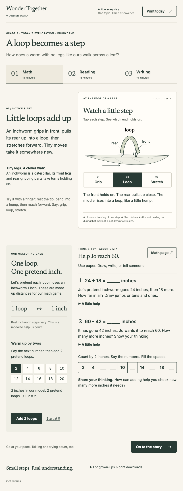
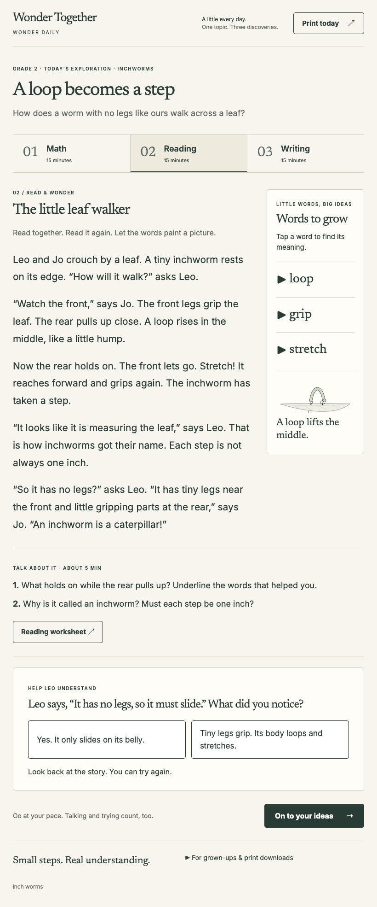
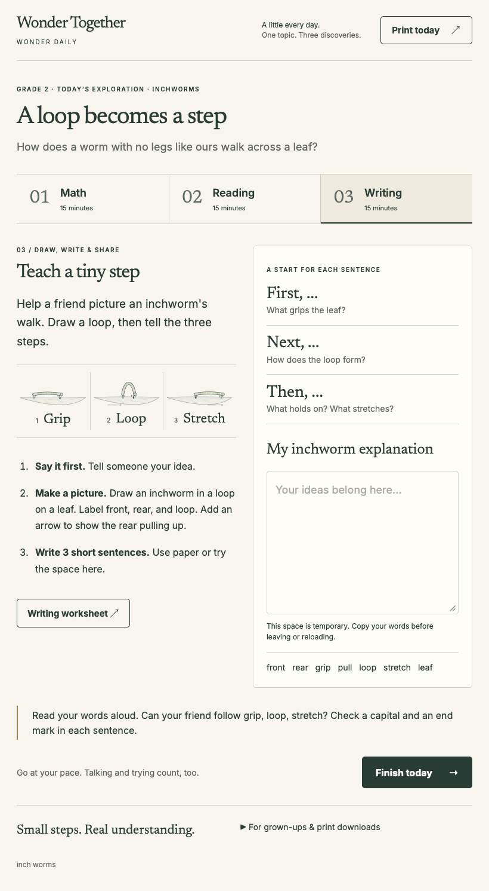
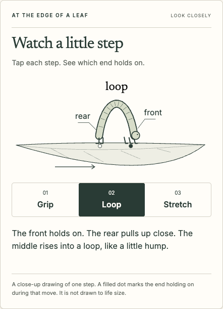
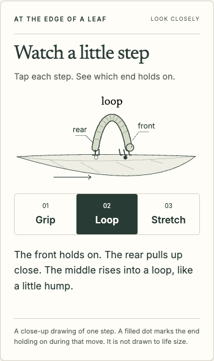
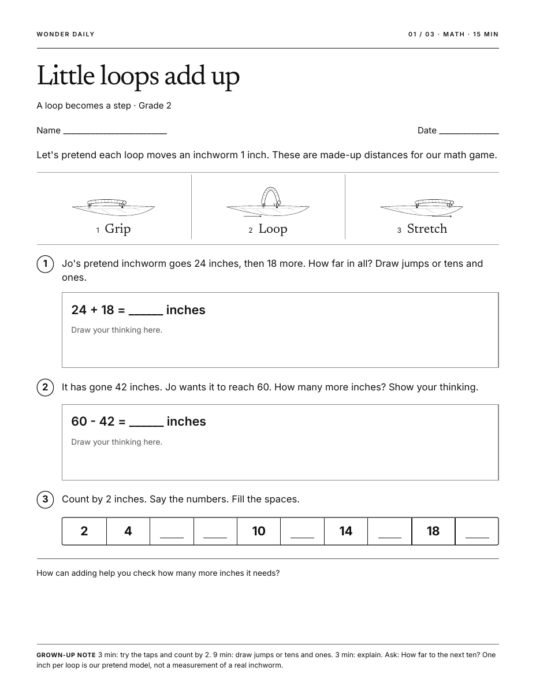

# Inchworms · Firstmate review

Task **`leo-inchworms-g2`** · branch **`codex/inchworms-grade2`**

One curated Grade 2 day: **A loop becomes a step**. Prepared for adversarial review; no PR, merge, deployment, or public navigation change.

## What to inspect

- **Sequence:** Grip fixes the front; Loop pulls the rear toward it; Stretch fixes the rear and reaches the front forward. A filled dot marks the holding end during the move. Tap any stage or revisit it; motion lasts one second and never loops automatically.
- **Model:** each pretend loop stands for 1 inch in the math game. The story, math introduction, and parent guidance distinguish this from real movement. The name comes from looking like measuring, and the story identifies the animal as a caterpillar with tiny legs.
- **Grade 2:** 24 + 18 = 42, then 18 more to 60; a count-by-two strip; optional tens-bridge hints; loop/grip/stretch vocabulary; a misconception check; labeled drawing and First/Next/Then frames. Read-aloud help and dictation count.
- **Craft:** Newsreader headings, Inter reading text, warm stock, deep ink, fine rules, and restrained information color. The same segmented leaf illustration and type roles carry onto Letter paper. Print workspaces stay blank and the answer key stays separate.

## Digital

### Math

### Reading

### Writing

### Loop detail, tablet and phone

## Paper

[Reading page](stills/inchworms-print-kid-2.png) · [Writing page](stills/inchworms-print-kid-3.png) · [Separate parent key](stills/inchworms-print-key-1.png)

Five generated PDFs live in `output/pdf/` and `dist/pdf/`; build outputs remain gitignored by repository convention. Print US Letter at 100% / actual size.

## Validation

- `npm ci` and `npm run format:check`: pass.
- `npm run build`, `npm test`, `npm run test:browser`: engines pass.
- `npm run test:inquiry`: weather and fair-sharing pass; engines restored.
- `npm run generate -- "inch worms"`, `npm test`, `npm run test:browser`: pass; final local outputs contain inchworms.
- Six unit tests pass, including aliases, curated metadata, escaping, PDF page counts and Letter dimensions.
- All three curated days pass Chromium and WebKit at 820×1180, 390×844, and 1024×768. Checks include automated accessibility, 44px targets, enlarged-text overflow, no external asset requests, no-JavaScript reading, and appropriate subject interactions.
- Inchworm motion checks verify alternating anchors, keyboard/touch, rapid reset, leaving Math, and changing reduced-motion preference; reading feedback and retained writing drafts are covered.
- All four grayscale print pages were visually reviewed. The five `output/pdf` files match `dist/pdf` byte for byte.

Browser emulation covers the listed engines and viewports; this is not an actual iPad hardware or physical-printer test. `npm run build` remains the command to restore engines.
